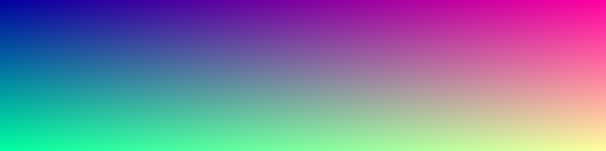

# Test Docs

Welcome to the Docs Panel test project.

## What to look at

- Headings render with styling.
- The picture below must appear inside this page.
- Tables and code blocks pick up the editor theme.


A picture one folder deeper, reached with `..`:


## Table

| Item | Value |
|---|---|
| Split | Draggable |
| Tree | Collapsed at start |

## Code

```ts
const answer: number = 42;
console.log(answer);
```

Inline `code` and a [link](https://example.com).

## Links to other files

- [Getting Started](guides/getting-started.md)
- [Deep Dive](./guides/advanced/deep-dive.md)
- [API Reference](api/reference.md)
- [Plain text file](notes.txt)
- [Outside link](https://example.com) stays a normal link.

## Zoom check

Click the wide picture. It must open big and keep its shape.


